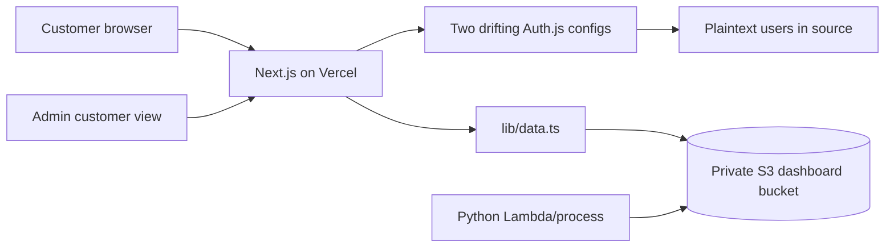
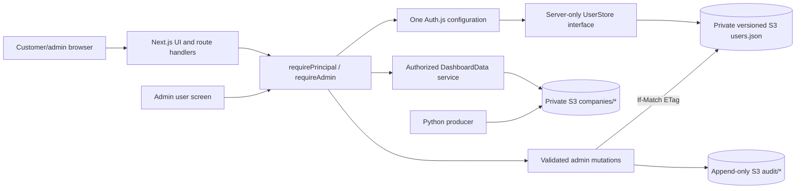

# Dashboard Frontend Quality Improvement Plan

**Prepared:** 2026-09-04  
**Scope:** this Next.js frontend, its authentication/user administration, and its contract with the separate Python/AWS dashboard-data producer  
**Primary constraint:** materially improve safety and maintainability on a very small budget while keeping the current dark/navy dashboard, SORCE branding, card layout, neon login treatment, and status colors recognizably the same

## Executive recommendation

There is a critical credential-exposure problem that should be fixed before normal refactoring. The current user module contains plaintext credentials and begins with `'use server'`. Next therefore registers all of its exports as Server Actions. A production build and a local unauthenticated request confirmed that the exported user lookup can return a stored credential field. The current credentials should be considered compromised.

The recommended direction is:

1. **Before building an admin UI.** A private versioned S3 JSON registry with hashes plus a safe CLI initially, makes the fewest infrastructure and visual changes.
2. **Add a small admin-only user screen only after the server-only store and authorization tests are sound.** Support create, disable/reactivate, role/tenant assignment, and admin-generated password replacement. Do not expose hashes and do not hard-delete users by default.

The rest of the work should be delivered in small, reversible pull requests with fixtures and visual screenshots in place before broad UI or dependency changes.

## Emergency notice: do this first

- Replace `'use server'` in [`lib/users.ts`](lib/users.ts) with `import 'server-only'`. Only deliberately designed, independently authorized mutation entry points should ever be Server Actions.
- Stop returning storage records from lookup/authentication functions. Return a sanitized principal containing only `id`, normalized username, role, tenant ID, display name, enabled state, and an auth/session version.
- Remove all credential, user-record, token, session, username/object-key, raw error, and chart-data logging from [`app/login/page.tsx`](app/login/page.tsx), [`lib/auth.ts`](lib/auth.ts), [`app/dashboard/page.tsx`](app/dashboard/page.tsx), [`lib/data.ts`](lib/data.ts), and [`chart-energy.tsx`](app/dashboard/components/chart-energy.tsx). Replace useful events with explicitly allow-listed structured fields. Purge or restrict any retained production logs that contain sensitive values.
- Patch the current vulnerable prerelease stack. Move off `next@15.6.0-canary.58` to a supported patched line and update `next-auth` beyond the affected beta range. See the dependency phase for the proposed low-risk sequence.
- Before issuing replacements, prepare a minimal private S3 bucket that accepts password hashes.
- Rebuild and verify that:
  - `lib/users.ts` exports are absent from every `server-reference-manifest.json`;
  - no real username, password, hash, or user registry appears in client assets, source maps, Edge/proxy bundles, or logs;
  - unauthenticated requests cannot invoke any user lookup or mutation;
  - old cookies stop authorizing requests.

## What was reviewed and verified

The review covered all application, library, configuration, component, README, and relevant generated build-manifest files in this repository. Generated shadcn-style primitives were treated as vendor-like code unless used by the application.

Commands were run after a frozen install from the committed lockfile:

| Check                            | Result                                                                     | Meaning                                                                                                                                                                              |
| -------------------------------- | -------------------------------------------------------------------------- | ------------------------------------------------------------------------------------------------------------------------------------------------------------------------------------ |
| `pnpm install --frozen-lockfile` | Passed                                                                     | The committed lockfile is installable. pnpm warned that `esbuild` and `sharp` build scripts were not approved.                                                                       |
| `pnpm exec tsc --noEmit`         | Passed                                                                     | The manually supplied types compile, but they currently hide the dynamic-route parameter bug and include several `any` casts.                                                        |
| `pnpm build`                     | Passed                                                                     | Production compilation succeeds. It warns that the middleware convention and browser data are outdated. A passing build does not exercise login, tenant selection, or empty data.    |
| `pnpm lint`                      | Failed                                                                     | `next lint` is no longer a usable lint command in this installed Next version; there is no ESLint/Biome configuration.                                                               |
| `pnpm exec prettier --check .`   | Failed                                                                     | 35 files differ from the configured format.                                                                                                                                          |
| Tests                            | None                                                                       | There is no test runner, test script, test file, coverage setup, or CI workflow.                                                                                                     |
| `pnpm outdated --format json`    | Many outdated packages                                                     | Major drift includes Next, React, AWS SDK, Recharts, Tailwind, Zod, and TanStack Table. Several packages are unused.                                                                 |
| `pnpm audit --prod --json`       | 64 advisories in the graph currently classified as production dependencies | 5 critical, 28 high, 26 moderate, and 5 low. Not every transitive advisory is necessarily reachable, but known direct Next/Auth.js issues and the absence of maintenance are urgent. |
| Server Action probe              | **Critical failure**                                                       | A production build registered all exports of `lib/users.ts`; an unauthenticated local request to the lookup action returned a stored credential field.                               |

Dependency counts are a point-in-time snapshot from 2026-09-04. Re-run the audit during implementation and evaluate reachability rather than blindly forcing incompatible versions.

## Current architecture and principal risks



### Authentication and authorization

- [`lib/users.ts`](lib/users.ts) contains roughly 30 active accounts, including the sole admin, with plaintext passwords committed across many revisions.
- The file-level `'use server'` directive registers `validateUser`, `findUserByName`, and `isAdmin` as callable Server Actions. `findUserByName` returns the complete record, including the password field. This was confirmed in the generated server-reference manifests and through an unauthenticated local request.
- [`app/login/page.tsx`](app/login/page.tsx) logs the submitted username and plaintext password in the browser. [`lib/auth.ts`](lib/auth.ts) logs raw credentials, the secret-bearing user record, tokens, and sessions.
- [`lib/auth.ts`](lib/auth.ts) and [`app/api/auth/[...nextauth]/route.ts`](app/api/auth/%5B...nextauth%5D/route.ts) each instantiate Auth.js independently. The HTTP sign-in route and server-side `auth()` therefore do not share one source of truth for callbacks or session fields.
- Passwords are compared as raw strings. There is no hashing/KDF, disabled state, session invalidation version, login throttling, audit trail, or recovery process.
- The real route protection comes from checks inside pages. [`middleware.ts`](middleware.ts) defines no `authorized` callback and should not be treated as a complete authorization boundary. All APIs are excluded from it, so each present and future API/action needs its own default-deny authorization.
- [`teamStats()`](lib/data.ts) has no authorization inside the service. The current page checks admin first, but a future caller can accidentally expose all-company data.
- Positive finding: the customer dashboard currently derives the company from the signed session on the server, and chart lookup is confined to that company's loaded file. No current URL-controlled cross-tenant S3 key was found.

### Tenant/data integration

- User identity, company display name, role, and dashboard-data location are combined in one record.
- [`lib/data.ts`](lib/data.ts) derives the S3 filename from the mutable display name plus a hardcoded public salt. Renaming a company can silently disconnect it from its data. The hash is obscurity, not access control.
- S3 bucket name and default behavior are hardcoded. Production silently defaults to S3, while development silently defaults to `public/`; a misconfigured preview can therefore read production data.
- JSON is parsed with a TypeScript cast only. Runtime payloads are not validated. The interfaces incorrectly describe JSON date strings as `Date` objects in several places.
- All S3 and parse failures in the customer path collapse to `null`, which makes valid authenticated users look logged out or unconfigured.
- The `/dashboard` redirect performs a data read and the dynamic page performs another. Team-link prefetching can create still more S3 reads.
- Local dashboard fixtures are expected in `public/`, where they would be web-addressable. No useful sanitized JSON fixtures are committed, making UI regression work difficult.
- Employee wellness/HRV and personality aggregates deserve careful tenant isolation and log hygiene even if the business does not classify them as highly confidential.

### Confirmed and likely UI bugs

1. **Mobile is blank.** The main dashboard and its no-data states use `hidden flex-col md:flex` in [`app/dashboard/page.tsx`](app/dashboard/page.tsx) and [`app/dashboard/[chartName]/page.tsx`](app/dashboard/%5BchartName%5D/page.tsx).
2. **Team selection displays the wrong team's data.** The folder parameter is `chartName`, but the page reads `params.chartId`. The picker changes the URL and its selected label while the page falls back to the first chart.
3. **The dynamic no-data state is unreachable.** Falsy data first redirects to login, then a later branch checks the same value for `null`.
4. **Valid empty payloads crash.** Several paths assume `charts[0]`, `today[0]`, `teams[0]`, or `line[0]` exists.
5. **Missing data is falsely shown as zero.** Engagement, HRV, and sparkline components coerce absent values to `0`, fabricating measurements and trend dips.
6. **Team picker behavior is inconsistent.** Each menu option shows the currently selected team's initials; keyboard selection can do nothing; only the nested inline link is clickable; long names do not fit the fixed width; and zero teams crash.
7. **Charts are not reliably responsive.** The HEXACO chart is fixed at 600x500, Victory charts initially render at width zero, legends/range buttons do not wrap, and resize handling only follows the window rather than the actual container.
8. **Energy markers can be assigned to the wrong point.** Marker colors are joined by array index even though the data supplies `dataPointIndex`.
9. **Date ranges use browser “now,” not the dataset's latest timestamp.** Stale/historical data can produce an apparently empty week or month.
10. **The admin recordings chart breaks across month boundaries.** It plots day-of-month on a fixed 1–31 axis, so August 31 followed by September 1 goes backwards.
11. **Navigation and sign-out are not dependable.** The main navigation is commented out, admins have no discoverable link to customer stats, and sign-out exists only inside the team picker.
12. **Loading/error/404 experiences are absent.** There are no route `loading.tsx`, `error.tsx`, or `not-found.tsx` files despite server-side S3 reads.
13. **Accessibility gaps are material.** Bare SVG tooltip triggers are not proper labelled controls, charts have no textual alternative, sorting state is not announced, status is color-dependent, and semantic header/main/heading structure is weak.
14. **Root/orphan routes are misleading.** `/` always claims the visitor is signed out, `/charts` is unfinished template UI, and `/api/seed` is public dead scaffolding that would be risky if reactivated.
15. **Small visual defects exist.** Invalid Tailwind classes (`text-2m`, `text-m`), a `insert-0` typo, an orphan fifth status card, repeated archetype copy, fixed alignments on stacked mobile metrics, and Analytics outside `<body>` should all be corrected.

One domain comment must be preserved deliberately: [`status-section.tsx`](app/dashboard/components/status-section.tsx) explains that the labels changed in August 2026 while the producer still emits legacy field names. Keep that compatibility mapping at the normalization boundary and cover it with a regression test; do not “clean up” those keys independently in this repository.

### Maintainability and dependency debt

- Next is a stale canary, React/ReactDOM are release candidates, React type packages are v18, and `@types/next-auth` v3 is deprecated while the runtime is Auth.js v5 beta. The deprecated type package also brings a second NextAuth major into the lockfile.
- The Next canary and Auth.js beta in the lockfile fall in disclosed vulnerable ranges. As of this review, Next's supported patched choices are the 15.5 maintenance line or 16.3 active line, and Auth.js fixed the relevant v5 beta issue in beta.32.
- The cited Auth.js issue concerns checks that trust the bare existence of an auth object during a configuration error. The current page guards check `session.user`, so that exact page pattern was not found here; the package should still be patched, and the current middleware provides no authorization callback at all.
- Recharts 2 and some old Radix transitive packages declare React support only through v18, while the lockfile forces React 19 RC. Upgrade this group together and test visuals/interactions.
- Unused direct packages include the Neon client, Drizzle ORM/tooling/integration, Day.js, React ApexCharts, and currently Zod. Retain Zod only if it is put to use for runtime validation. `server-only` is installed but not used where it matters.
- Build tools and type packages are incorrectly listed as runtime dependencies.
- Two Tailwind configs compete; the JavaScript version even represents `container.center` as the string `'true'` while the TypeScript version uses a boolean.
- There is dead/copied template code, commented-out implementations, unused imports and components, and three chart libraries for a small application.
- TypeScript is strict, which is a useful base, but `skipLibCheck`, stale ES5 targeting, unchecked JavaScript, explicit `any`, unused imports, and manually incorrect route prop types reduce its value.
- There is no pinned Node/pnpm contract. Pin the current supported LTS rather than relying on a floating local Node installation.

## Target architecture

This diagram shows Track B, the S3 working assumption.



Key boundaries:

- The browser supplies credentials and UI choices, never an S3 object key or role.
- Auth resolves a user to a sanitized `Principal`; storage records never cross that boundary.
- Authorization helpers are server-side and used again inside every page, route handler, and Server Action.
- Dashboard access accepts a validated principal/tenant ID, not an arbitrary username.
- User storage and dashboard data use separate prefixes and preferably separate IAM roles. The Python producer cannot write the auth prefix.
- Shared Zod schemas or generated JSON Schema define the frontend/producer payload contract.

## User-management decision

| Option                     | Incremental cost                                                    | Operational fit                                                                                                | Password change/recovery                                                                                     | Administration                          | Recommendation                                    |
| -------------------------- | ------------------------------------------------------------------- | -------------------------------------------------------------------------------------------------------------- | ------------------------------------------------------------------------------------------------------------ | --------------------------------------- | ------------------------------------------------- |
| **Private S3 JSON bucket** | Tiny incremental S3 request/storage cost in an already-used service | Excellent for ~30 users and rare writes; requires careful conditional writes and ongoing custom-auth ownership | Admin reset is straightforward; signed-in change is possible; forgot-password needs another verified channel | Safe CLI first; optional app admin page | **Track B: fewest infrastructure/visual changes** |

### Outline: Proposed S3 bucket

Use JSON rather than TOML because the application and producer already use JSON, Node has native parsing, schema validation is simpler, and admin writes need deterministic machine serialization. Human editing should be a break-glass operation, not the normal admin workflow.

The following is illustrative and contains no real data:

```json
{
  "schemaVersion": 1,
  "updatedAt": "2026-09-04T10:00:00.000Z",
  "tenants": [
    {
      "id": "tenant_example",
      "displayName": "Example Company",
      "dashboardObjectKey": "companies/tenant_example.data.json",
      "enabled": true
    }
  ],
  "users": [
    {
      "id": "01990d66-0000-7000-8000-000000000001",
      "username": "example.admin",
      "password": {
        "algorithm": "scrypt",
        "parametersVersion": 1,
        "salt": "base64-value",
        "hash": "base64-value"
      },
      "role": "admin",
      "tenantId": "tenant_example",
      "enabled": true,
      "authVersion": 1,
      "createdAt": "2026-09-04T10:00:00.000Z",
      "updatedAt": "2026-09-04T10:00:00.000Z"
    }
  ]
}
```

Implementation details:

- Normalize usernames with an explicitly documented rule, initially `trim()` plus locale-independent lowercase. Detect collisions before migration; at least one current username differs in case.
- Use stable generated IDs. Keep `displayName` presentation-only and store an explicit dashboard object key.
- Store only versioned password hashes with unique random salts. Built-in Node `crypto.scrypt` avoids a native dependency; Argon2id is also suitable if its deployment package is verified. Benchmark parameters on the production runtime and use `timingSafeEqual`.
- Verify a fixed dummy hash when a username is absent so obvious timing differences do not reveal account existence.
- `UserStore.load()` returns a schema-validated registry plus ETag. Missing, invalid, or unavailable auth data fails closed.
- `UserStore.mutate()` performs a fresh read, applies one validated mutation, rechecks invariants, and writes with `If-Match: <etag>`. A 409/412 produces a visible conflict/retry instead of silently overwriting another administrator's update.
- Enable S3 versioning and Block Public Access. Default SSE-S3 is sufficient here unless company policy requires a customer-managed KMS key.
- Use least-privilege IAM: dashboard reader for `companies/*`; auth reader for the one registry object; admin mutation role for that object plus `auth/audit/*`; producer writer for company data only.
- Do not fetch or deserialize the registry in client code. Keep the repository, password functions, and admin mutations in Node-only `server-only` modules; do not bundle them into Edge middleware/proxy code.

### Track B authentication/session flow

1. Keep exactly one Auth.js configuration in `lib/auth.ts`; the route file should only re-export that configuration's `GET` and `POST` handlers.
2. Validate and normalize credential input with size limits. Return the same generic response for unknown username, wrong password, disabled account, and malformed input.
3. Verify the hash, then create a sanitized principal. Do not include hash/salt/storage metadata in the returned user or token.
4. Include `userId`, `tenantId`, `role`, and `authVersion` in a typed JWT/session. Add proper Auth.js module augmentation instead of `any` casts.
5. Set an explicit session lifetime appropriate for this low-risk dashboard (for example, one workday) and document the choice.
6. On disable, password reset, or role change, increment `authVersion`. Recheck it against authoritative state for every admin operation and protected data request, or use a documented short cache window if the added S3 latency is unacceptable.
7. Add a durable serverless-compatible login throttle. Prefer a capability already included by the hosting/identity provider; otherwise use a tiny DynamoDB TTL table or another deliberately selected shared store. Do not rely on in-memory counters in Vercel instances. Key by a privacy-preserving combination of account and IP, use bounded exponential delay, and avoid permanent denial-of-service lockouts.
8. Explicitly configure the custom sign-in page and safe callback handling. Verify secure, HttpOnly, SameSite cookies and CSRF/origin behavior in production.

### Track B admin user screen

Create `/admin/users` within a shared authenticated layout. Every server-render and every mutation must call `requireAdmin()`; hiding controls is not authorization.

Minimum features:

- List username, role, tenant, enabled/disabled state, last modified time, and last successful login if captured. Never send password hashes or salts to the client.
- Add a user to an existing tenant.
- Disable/reactivate a user; prefer soft disable over deletion.
- Change tenant and viewer/admin role.
- Generate/reset a strong replacement password, display it once, never log it, and increment `authVersion`. Call it “temporary” only if a `mustChangePassword` state and enforced first-login change are actually implemented.
- Prevent duplicate normalized usernames and prevent disabling, deleting, or demoting the last enabled admin. Start with at least two individually named admins rather than one shared account.
- Require a recent authentication for high-impact changes if practical.
- Write an append-only audit record for actor, action, target ID, timestamp, result, and request correlation ID. Never include a password or hash.
- Show an explicit “tenant configured, data not generated yet” state. Creating a login does not make the Python process generate company data.

Optional signed-in password change can use the same S3 mutation path: verify the current password, validate the new one, conditionally update the hash, increment `authVersion`, and sign out all sessions.

## Implementation phases

Estimates below are rough elapsed engineering days for one experienced engineer, excluding external review and waiting for credential delivery. They are order-of-magnitude planning ranges with roughly ±50% confidence until representative data, deployment access, and browser fixtures are available—not commitments.

### Budget cut line

- **Non-negotiable emergency work:** Phase 0. If this cannot be funded immediately, restrict the live application rather than knowingly leaving the credential action exposed.
- **Minimum responsible stabilization (roughly 4–8 days total under the S3 assumption):** Phase 0; a narrow version of Phase 1 covering clean CI, secret scanning, and critical fixtures; the mobile/team-selection/empty-data/login fixes from Phase 2; and the read-only S3 registry with a safe CLI for adding/resetting users. This can defer the polished admin UI while still removing deploy-time plaintext credentials.
- **Recommended small-company target (roughly 10–18 days total under the S3 assumption):** complete Phases 0–3 and the runtime validation/error portion of Phase 4. This delivers the admin workflow, dependable UI, tenant-safe data boundary, and maintainable quality gates.
- **Safe to defer:** self-service password change; Tailwind 4; chart-library consolidation; elaborate telemetry; and non-critical UI polish. Keep them as explicit backlog items rather than mixing them into security fixes.

### Phase 0 — Contain active risk (start immediately, 1–3 days)

Deliver one small emergency release:

- Remove `'use server'` from the user repository and add `server-only`.
- Make lookup/auth results incapable of containing a password.
- Remove secret-bearing logs and add a temporary redacted error logger.
- Consolidate Auth.js configuration enough that routes and server helpers use the same callbacks.
- Remove the hardcoded user array from the current tree and ship with no plaintext or legacy-code fallback. Rollback must restore the prior S3 object version never the exposed source list.
- Patch Auth.js to beta.32 or newer compatible v5 release. Never gate on the bare truthiness of an auth object; require a concrete session user and explicit role.
- Move from the unsupported Next canary to patched stable Next 15.5.24 with a compatible stable React/ReactDOM/type set as the lowest-risk supported stable target. If compatibility work is equivalent, move directly to the supported Next 16.3.x line.
- In the same compatibility PR, fix the dynamic page contract to `params: Promise<{ chartName: string }>` and await it. Do not carry the currently incorrect synchronous `chartId` prop through the stable Next migration.
- Run the focused unauthenticated action/auth matrix and inspect built bundles/manifests.

Acceptance gate:

- No user repository export is a Server Action.
- No old credential or session works.
- No plaintext password remains in the current source tree or newly built artifacts; authentication reads only hashed records from a private runtime source.
- Unauthenticated and non-admin callers cannot read a user record or invoke a mutation.
- No credential value appears in browser/server logs or client/Edge assets.
- Login and one customer dashboard smoke test pass after the dependency hotfix.

### Phase 1 — Establish a reproducible safety net (2–4 days)

- Pin a supported LTS Node release and exact pnpm major/version using `engines`, `packageManager`, and `.nvmrc` or `.node-version`; use the same versions in CI.
- Add scripts for `format`, `format:check`, `lint`, `typecheck`, unit tests, e2e tests, and production build.
- Configure ESLint flat config with Next core-web-vitals, React hooks, TypeScript, accessibility, and no-floating-promise rules, or adopt Biome plus any missing Next/a11y checks. Fix findings rather than blanket-disabling rules.
- Format the repository in a standalone mechanical commit.
- Add Vitest and Testing Library for pure/component tests and Playwright for critical browser flows and screenshots.
- Add anonymized, deterministic dashboard fixtures outside `public/`: populated, multiple teams, empty charts, empty `today`, missing values, malformed payload, stale timestamps, and month-boundary team activity.
- Capture baseline screenshots at 375, 768, 1280, and 1440 px before intentional UI fixes.
- Add CI: frozen install, format check, lint, typecheck, unit tests, production build, Playwright smoke suite, secret scan, and scheduled dependency audit.
- Add branch protection so the required checks must pass.

Acceptance gate: a fresh clone with documented tool versions runs all checks using only sanitized fixtures and no production AWS access.

### Phase 2 — Fix routing, data truthfulness, and responsive UI (3–7 days)

Make these separate reviewable changes while preserving colors, typography, card appearance, and logo treatment:

- Rename or read the dynamic segment consistently (`chartName`), use the current Next async `params` contract, validate/decode it, and return not-found for an unknown chart rather than silently showing the first one.
- Remove the mobile visibility gate. Use a shared responsive header and `main` layout; stack title/date and make the team picker full width on narrow screens.
- Handle zero charts, zero teams, no current-day record, no line data, and partial HEXACO arrays without indexing errors.
- Preserve `null` as missing. Display an em dash/“No data”; draw chart gaps rather than false zeros; include units and accessible trend labels.
- Repair the team picker: option-specific initials, full-row keyboard/pointer selection, encoded IDs, close-on-select, long-name truncation, and explicit zero/one-team behavior.
- Keep sign-out available in populated, empty, loading, error, and mobile states. Add the admin navigation link only for an authorized admin.
- Preserve and test the August 2026 display-label-to-legacy-data-key mapping for the five status questions until the producer contract changes in coordination.
- Add `loading.tsx`, `error.tsx`, and `not-found.tsx` using the existing card visual language. Distinguish not configured, not generated yet, temporarily unavailable, invalid data, and unauthorized.
- Fix chart marker joining by `dataPointIndex`; sort/normalize timestamps; derive date windows from the latest data; guard invalid domains; hoist generated Victory containers; use `ResizeObserver`/responsive containers.
- Make HEXACO responsive and define its validated score domain. Add useful rings/labels and handle incomplete data honestly.
- Plot admin activity by full timestamp over a real rolling 10-day domain, not day-of-month. Restore details through an accessible tooltip and tabular fallback.
- Make range controls and legends wrap, give controls focus/pressed semantics, label charts, and supply compact tabular/download alternatives where useful.
- Replace bare tooltip SVGs with labelled buttons usable by keyboard/touch. Add `aria-current`, `aria-sort`, non-color status text, a skip link, correct heading structure, and semantic `header`/`nav`/`main` regions.
- Respect `prefers-reduced-motion` in neon/shimmer effects and eliminate per-keystroke layout measurement in the login card.
- Fix the smaller class/layout/copy errors without redesigning the product.

Acceptance gate:

- Login, dashboard, empty/error/loading states, team switching, and sign-out work at 320–1440 px.
- A deep link and every picker choice show the selected team's known fixture values after reload.
- Missing metrics never appear as measured zero.
- Keyboard-only and basic automated accessibility tests pass.
- Approved visual diffs show only intentional responsive/bug fixes.

### Phase 3 — Complete the S3 user store and admin workflow (6–12 days)

- Refine the emergency `UserStore`, `Principal`, `UserRecord`, and `Tenant` types and add explicit mutation/result types in server-only modules.
- Begin with a focused AWS SDK update and S3 integration test so the selected client version supports the conditional `PutObject` API and error types used below.
- Extend the private S3 JSON implementation with ETags, conditional writes, versioning, explicit error types, redacted structured logs, and comprehensive repository unit tests.
- Keep each already-live emergency record's `dashboardObjectKey` pointed at the existing generated object so the Python producer need not change during this phase.
- Implement one central auth flow with hashed password verification, typed sessions, disabled state, role checks, `authVersion`, generic failure UI, pending state, duplicate-submit prevention, and login throttling.
- Build the minimal admin user screen and audited server-side mutations described above.
- Add a break-glass CLI/runbook that uses the same repository and validations for recovery if the UI is unavailable.
- Turn the emergency migration script into a registry-integrity validator that inventories active records, detects normalized-name/ID/tenant collisions, rejects plaintext output, and verifies at least two admins.
- Copy the live registry to a non-production key and stage the new mutation/admin behavior against that copy. Test invalid JSON, missing object, IAM denial, timeout, ETag conflict, version rollback, and last-admin invariants before enabling writes against the live registry.
- Deploy the expanded store and admin features in place.

Acceptance gate:

- Admin can create, disable/reactivate, reassign, and reset a test user without a deploy.
- Concurrent edits cannot silently lose updates.
- Reset/disable invalidates sessions according to the documented cache/session policy.
- Registry failure denies authentication and admin mutations without exposing internals.
- A viewer cannot load another tenant or any admin data by changing URLs, form fields, action IDs, or request bodies.

### Phase 4 — Harden the dashboard-data contract (3–6 days, coordinated with Python repo)

- Create versioned Zod schemas for company dashboard data and team stats. Generate JSON Schema for the Python producer or maintain shared contract fixtures checked in both repositories.
- Correct wire types: JSON timestamps are strings at the boundary and become validated `Date`/epoch values only during normalization.
- Add `schemaVersion`, `generatedAt`, stable tenant ID, and optional data-quality warnings to producer output.
- Decouple object keys from display names. A low-risk migration can have Python write both legacy and stable keys, switch the frontend to stable keys, verify, and then retire legacy objects.
- Return a discriminated result from the data service: `ok`, `notConfigured`, `notGenerated`, `temporarilyUnavailable`, `invalidPayload`, or `forbidden`. Do not convert every failure to `null`.
- Add bounded AWS SDK timeouts/retries and short server-side caching/revalidation appropriate to the producer refresh interval. Authorize before cache lookup and ensure tenant IDs are part of cache keys.
- Avoid the double read on `/dashboard`; render the first valid team in one request or redirect from already validated cached metadata.
- Make bucket, region, keys, data source, and cache interval explicit validated environment configuration. Preview/local should fail closed and never silently use production.
- Add contract tests using producer-generated golden fixtures and one staging S3 smoke test outside pull-request CI.

Acceptance gate: the producer and frontend reject incompatible schema changes in CI, stale/partial data is labelled accurately, and a missing/malformed S3 object produces an actionable page rather than a login redirect or crash.

### Phase 5 — Dependency and codebase modernization (2–6 days)

Do upgrades in compatibility groups and keep each major migration separate from feature work:

1. **Already urgent in Phase 0:** supported stable Next/React/ReactDOM/types and patched Auth.js.
2. After the focused Phase 3 conditional-write update, keep the AWS SDK on a reviewed supported line and test S3 read/write/error behavior during routine updates.
3. Remove deprecated `@types/next-auth`; use built-in types and module augmentation.
4. Remove unused Neon, Drizzle, Day.js, React ApexCharts, and dead integration dependencies. Retain Zod and `server-only` because the target architecture uses them.
5. Move TypeScript, type packages, Prettier, Tailwind/PostCSS/Autoprefixer, lint/test tooling, and any migration CLI packages to `devDependencies`.
6. Consolidate the duplicate Tailwind files into one typed configuration. Patch the current v3 line first; treat Tailwind 4 as an independent later migration because it can change rendering.
7. Update Radix/shadcn primitives and Recharts together with the React version they support. Exercise popovers, dialogs, tooltips, tables, keyboard navigation, and chart screenshots.
8. Upgrade TanStack Table, Zod, Tailwind, and chart-library majors one at a time. Avoid `--force`/peer-dependency suppression as a migration strategy.
9. Remove React ApexCharts immediately. Consider consolidating Victory and Recharts only after visual tests; reducing one chart library is useful, but a risky rewrite is not required for initial quality.
10. Delete confirmed-dead routes/components/imports/comments: the `/charts` template, `/api/seed`, fake `UserNav`, and unused generated UI primitives. Protect rather than delete anything still needed operationally.
11. Replace ES5 targeting with a modern browser/server target, turn off `allowJs` after converting the one helper script or enable `checkJs`, and eventually evaluate disabling `skipLibCheck` after the type ecosystem is aligned.
12. Define pnpm's trusted build-script policy explicitly so `sharp`/`esbuild` behavior is reproducible.

After stabilization, enable weekly grouped Dependabot or Renovate minor/patch updates, immediate security updates, and a monthly reviewed major-upgrade issue. Never auto-merge visual-library or authentication majors.

Acceptance gate: no critical/high reachable production advisory is knowingly left without a documented exception; peer dependencies align; the lockfile has one intended Auth.js/React family; clean CI and visual tests pass.

### Phase 6 — Documentation, operations, and ongoing quality (1–3 days initially)

- Replace the “edit `lib/users.ts` and deploy” README flow with admin, recovery, rotation, local fixture, and deployment runbooks.
- Commit a reviewed secret-free `.env.example`; remove stale Postgres/GitHub values and document all required auth, S3, data-source, and cache settings. The existing working-tree `.env.example` should be reviewed rather than overwritten blindly.
- Document least-privilege IAM and which system owns each S3 prefix. Prefer workload identity/temporary credentials where possible.
- Add a release checklist: backup/version ID, deploy, login matrix, tenant-isolation check, S3 smoke check, error monitoring, and rollback.
- Add security headers deliberately: begin Content Security Policy in report-only mode because the chart libraries use inline styles, then enforce `frame-ancestors`, content-type, referrer, transport, and permissions policies after testing them in preview.
- Use structured, redacted logs with request/correlation ID, operation, coarse error category, latency, and internal tenant/user ID. Never log credentials, full tokens, raw health payloads, or hashes.
- Add a minimal health/readiness check that validates configuration without leaking bucket names, keys, accounts, or customer data.
- Establish ownership and a lightweight cadence: weekly dependency bot review, monthly restore test, quarterly account/admin review, and immediate credential rotation on staff/contractor changes.

## File-level change map

| Area                       | Primary files                                                                           | Planned change                                                                                                          |
| -------------------------- | --------------------------------------------------------------------------------------- | ----------------------------------------------------------------------------------------------------------------------- |
| Auth configuration         | `lib/auth.ts`, `app/api/auth/[...nextauth]/route.ts`, `middleware.ts`/future `proxy.ts` | One config; typed principal/session; explicit guards; no logs; patched Auth.js; keep user repository out of Edge bundle |
| User storage               | `lib/users.ts` then `lib/users/*`                                                       | Emergency server-only fix; replace plaintext array with repository interface and S3 implementation                      |
| Admin                      | new `app/admin/users/*`                                                                 | Server-rendered safe list and authorized, validated mutations                                                           |
| Dashboard data             | `lib/data.ts`, `lib/sorce_data.ts`                                                      | Explicit configuration, stable keys, Zod boundary, discriminated errors, caching, correct date/null types               |
| Dynamic dashboard          | `app/dashboard/[chartName]/page.tsx`, `app/dashboard/page.tsx`                          | Correct async param, validate selection, avoid double fetch, reachable empty/error states, responsive layout            |
| Shared authenticated shell | new layout/header components; `main-nav.tsx`, `team-switcher.tsx`                       | Consistent logo/nav/team/account controls across all states and screen sizes                                            |
| Metrics/charts             | dashboard chart/status components                                                       | Preserve missing values; correct marker/domain/date logic; responsive/a11y behavior                                     |
| Admin stats                | `app/teamstats/*`                                                                       | Responsive company selector/table and true timestamp chart                                                              |
| Login/root                 | `app/login/page.tsx`, `app/page.tsx`, `app/layout.tsx`                                  | Pending/generic error state, no secret logs, auth-aware root redirect, valid body structure                             |
| Dead/template surface      | `app/charts`, `app/api/seed`, fake/unused components                                    | Delete after route/import verification                                                                                  |
| Tooling                    | `package.json`, `tsconfig.json`, Tailwind configs, new lint/test/CI files               | Stable supported versions, real quality scripts, one config, pinned runtime, CI                                         |
| Operations                 | `README.md`, `.env.example`, new `docs/*`                                               | Setup, IAM, migration, admin, recovery, deploy and rollback runbooks                                                    |

## Test and acceptance matrix

### Authentication and authorization

- Missing, malformed, oversized, unknown-user, wrong-password, disabled-user, and throttled requests all return the same generic login result.
- Passwords, hashes, salts, raw tokens, and complete user records never appear in client props, action responses, bundles, source maps, logs, analytics, or error pages.
- Anonymous/viewer/admin access matrix covers every page, route handler, and Server Action.
- Direct action-ID calls and forged request bodies cannot bypass `requireAdmin()` or choose another tenant.
- Password reset, disable, and role change invalidate old sessions within the documented bound.
- Last-admin, duplicate normalized username, unknown tenant, and concurrent-update invariants are enforced; S3 registry missing/invalid/denied/timed-out cases fail closed; object-version recovery is rehearsed.

### Dashboard correctness

- Valid login reaches the first team; each selection and deep link shows fixture-specific values and survives refresh.
- Unknown chart IDs return a defined not-found state.
- Empty charts, teams, `today`, line/range/marker arrays, incomplete HEXACO values, null metrics, and invalid dates do not crash.
- Null metrics show missing state, never zero. Zero remains a valid measured value.
- Sparse marker indices map to the intended data points.
- Week/month/all domains anchor to the latest valid dataset timestamp.
- Ten-day admin activity remains chronological across month/year and daylight-saving boundaries.
- Producer schema versions, malformed JSON, stale data, and partial data produce the intended states.

### UI, accessibility, and visual stability

- Viewports: 320, 375, 768, 1024, 1280, and 1440 px.
- Keyboard: login, team picker, help content, sign-out, admin forms, company selection, and table sorting.
- Screen-reader basics: page/region headings, labelled inputs and icon buttons, current selection, sort direction, errors/status, chart summary/data alternative.
- Reduced motion disables or reduces neon/shimmer animation without removing usability.
- Screenshot baselines: login idle/pending/error; populated/empty/loading/error dashboard; every chart family; mobile selector; admin list/form/stats.
- Cross-browser smoke: Chromium plus Firefox and WebKit for login, picker, chart sizing, and admin table.

### Build and operations

- Fresh frozen install on the pinned Node/pnpm versions.
- Format, lint, typecheck, unit/integration, build, Playwright smoke, secret scan, and dependency-policy checks pass in CI.
- Preview deployment uses only fixtures/staging S3 and can never fall through to production data.
- Production smoke tests cover one viewer, one admin, tenant isolation, data freshness, sign-out, and rollback.

## Suggested pull-request sequence

2. **Patched stable Next/React/Auth.js alignment.**
3. **Toolchain pins, real lint/format/typecheck scripts, and CI.**
4. **Sanitized fixtures plus unit/e2e/visual baseline.**
5. **Dynamic-route, empty-data, mobile, login, and team-picker fixes.**
6. **Chart/date/null correctness and accessibility.**
7. **Track B only: complete the S3 repository's SDK update, conditional-write, versioning, and recovery behavior.**
8. **Track B only: complete typed session invalidation, throttling, and registry tooling.**
9. **Track B only: add the admin user UI, audit log, and password-reset flow.**
10. **Coordinated stable tenant key/data-contract migration with the Python repo.**
11. **Unused dependency/dead-code removal.**
12. **Remaining isolated major upgrades and documentation/runbooks.**

Each PR should state its rollback, include focused tests, avoid mixing mechanical formatting with behavior changes, and attach before/after screenshots for visible changes.

## Cost-conscious definition of done

The improvement program is complete when:

- No credential or reusable secret is stored in source/history-visible current files, returned by an action, sent to the client, or logged.
- User creation/disable/reset and tenant assignment no longer require a code edit or deployment.
- One central auth configuration and default-deny guards protect all pages, APIs, and actions.
- Versioned S3 backups, conditional writes, recovery instructions, and session invalidation;
- A customer can use the dashboard and sign out on mobile, tablet, and desktop; team selection is truthful; missing/stale/error states are explicit.
- Runtime S3 payloads are schema-validated and linked by stable tenant keys rather than display-name hashes.
- A clean clone passes automated formatting, linting, types, tests, build, accessibility smoke, visual regression, and secret/dependency checks.
- Direct dependencies are necessary, supported, peer-compatible, and assigned to runtime vs development correctly.
- The README and runbooks let a new maintainer add a user, diagnose missing data, deploy, rotate credentials, and roll back without reading implementation details.

## External references used for decisions

- [Next.js August 2026 security release](https://nextjs.org/blog/august-2026-security-release)
- [React Server Components security update](https://react.dev/blog/2025/12/03/critical-security-vulnerability-in-react-server-components)
- [Auth.js affected beta advisory](https://github.com/nextauthjs/next-auth/security/advisories/GHSA-8fpg-xm3f-6cx3)
- [Next.js 16 upgrade guide](https://nextjs.org/docs/app/guides/upgrading/version-16)
- [Next.js ESLint guidance](https://nextjs.org/docs/app/api-reference/config/eslint)
- [Amazon S3 conditional writes with ETags](https://docs.aws.amazon.com/AmazonS3/latest/userguide/conditional-writes.html)
- [Amazon S3 Block Public Access](https://docs.aws.amazon.com/AmazonS3/latest/userguide/access-control-block-public-access.html)
- [AWS IAM security best practices](https://docs.aws.amazon.com/IAM/latest/UserGuide/best-practices.html)
- [Vercel guidance on SQLite and ephemeral serverless storage](https://vercel.com/kb/guide/is-sqlite-supported-in-vercel)
